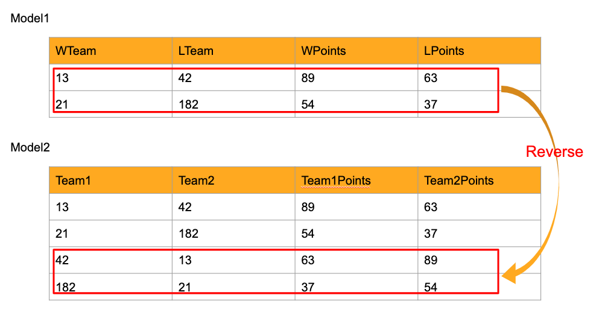
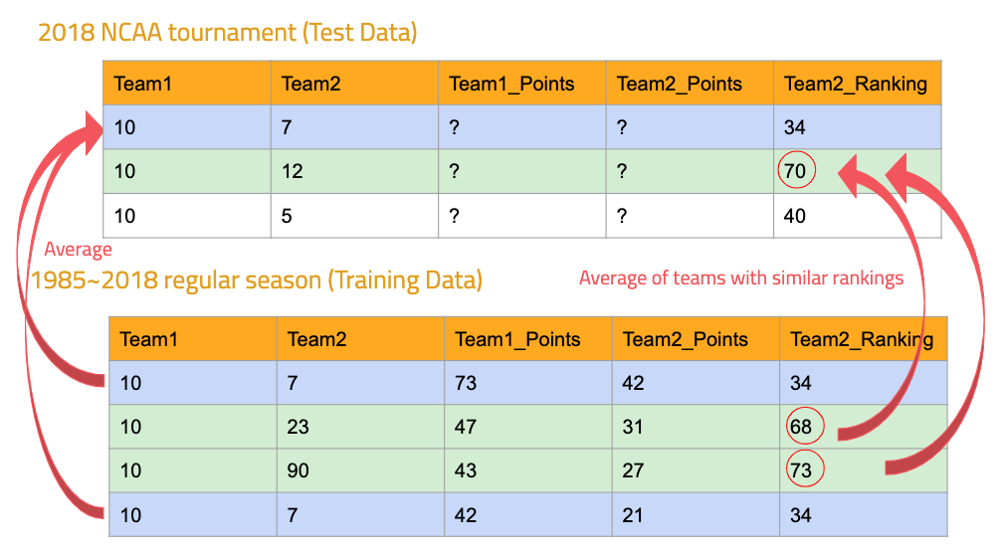

```{r setup, include=FALSE}
knitr::opts_chunk$set(echo = TRUE)
```

```{r global_options, include=FALSE}
knitr::opts_chunk$set(fig.pos = 'H')
```
# Data Modeling 
 Our goal is to get the most accurate predictions of NCAA tournament results in year 2018. To achieve this goal, we tried several machine learning methods, such as logistic regression, random forest, LDA and so on. Data modeling was divided into 3 parts: "Data Cleaning", "Feature Engineering", and "Statistical Modeling".  

## DATA CLEANING
  As we had already discussed, this project used many datasets and it was necessary to merge them and extract important features. First let's look through the dataset. The followings are the files we used. The data regarding the matchup before NCAA tournaments in 2018 was used as train data and the one of NCAA tournaments in 2018 was used as test data.  
  

**(Train data)**

  - RegularSeasonCompactResults_Prelim2018.csv: Game-by-game results for many *seasons* of historical data, starting with the 1985 season. For each season, the file includes   all games played from daynum 0 through 132. It is important to realize that the "Regular Season" games are simply defined to be all games played on DayNum=132 or earlier (DayNum=132 is Selection Sunday) 
  
  - NCAATourneyCompactResults.csv: Game-by-game *NCAA tournament* results for all seasons of historical data since 1985 until 2017.
  
  - RegularSeasonDetailedResults.csv: Team-level box scores for many *regular seasons* of historical data, starting with the 2003 season.
  
  - NCAATourneyDetailedResults.csv: Team-level box scores for many *NCAA tournaments*, starting with the 2003 season until 2017
  
  - MasseyOrdinals_Prelim2018.csv: Rankings (e.g. #1, #2, #3, ..., #N) of teams from 2002-2003 *season* to 2018, under a large number of different ranking system methodologies.
  
  - Players_XXXX.csv: Players list  from 2010 to 2018.  Each player is assigned to team they belonged to. 
  
  -Events_XXXX.csv: Play-by-play event logs for almost all games from that season. Elapsed seconds, event type, points are recorded. This data does not include NCAA tournament 2018.
  
**(Test data)**  

  - 2018NCAATourneyCompactResults.csv: Game-by-game *NCAA tournament* results for 2018.
  
  - 2018NCAATourneyDetailedResults.csv: Team-level box scores for *NCAA tournament* 2018

```{r eval=FALSE}
RegularSeasonCompactResults=read.csv("PrelimData2018/RegularSeasonCompactResults_Prelim2018.csv")
NCAATourneyCompactResults=read.csv("DataFiles/NCAATourneyCompactResults.csv")
NCAATourneyCompactResults_2018=read.csv("DataFiles/2018NCAATourneyCompactResults.csv")

RegularSeasonDetailedResults=read.csv("PrelimData2018/RegularSeasonDetailedResults_Prelim2018.csv")
NCAATourneyDetailedResults=read.csv("DataFiles/NCAATourneyDetailedResults.csv")
NCAATourneyDetailedResults_2018=read.csv("DataFiles/2018NCAATourneyDetailedResults.csv")

MasseyOrdinals=read.csv("PrelimData2018/MasseyOrdinals_Prelim2018.csv")

Events_2010=read.csv("PlayByPlay_2010/Events_2010.csv")
Events_2011=read.csv("PlayByPlay_2011/Events_2011.csv")
Events_2012=read.csv("PlayByPlay_2012/Events_2012.csv")
Events_2013=read.csv("PlayByPlay_2013/Events_2013.csv")
Events_2014=read.csv("PlayByPlay_2014/Events_2014.csv")
Events_2015=read.csv("PlayByPlay_2015/Events_2015.csv")
Events_2016=read.csv("PlayByPlay_2016/Events_2016.csv")
Events_2017=read.csv("PlayByPlay_2017/Events_2017.csv")
Events_2018=read.csv("PrelimData2018/Events_Prelim2018.csv")

Players_2010=read.csv("PlayByPlay_2010/Players_2010.csv")
Players_2011=read.csv("PlayByPlay_2011/Players_2011.csv")
Players_2012=read.csv("PlayByPlay_2012/Players_2012.csv")
Players_2013=read.csv("PlayByPlay_2013/Players_2013.csv")
Players_2014=read.csv("PlayByPlay_2014/Players_2014.csv")
Players_2015=read.csv("PlayByPlay_2015/Players_2015.csv")
Players_2016=read.csv("PlayByPlay_2016/Players_2016.csv")
Players_2017=read.csv("PlayByPlay_2017/Players_2017.csv")
Players_2018=read.csv("PrelimData2018/Players_Prelim2018.csv")
```

Because Player_XXXX dataset had some strange value: "TEAM", we excluded this from data.

```{r eval=FALSE}
#Delete the rows that have "TEAM" in playername column
Players_2010=Players_2010[Players_2010$PlayerName!="TEAM",]
Players_2011=Players_2011[Players_2011$PlayerName!="TEAM",]
Players_2012=Players_2012[Players_2012$PlayerName!="TEAM",]
Players_2013=Players_2013[Players_2013$PlayerName!="TEAM",]
Players_2014=Players_2014[Players_2014$PlayerName!="TEAM",]
Players_2015=Players_2015[Players_2015$PlayerName!="TEAM",]
Players_2016=Players_2016[Players_2016$PlayerName!="TEAM",]
Players_2017=Players_2017[Players_2017$PlayerName!="TEAM",]
Players_2018=Players_2018[Players_2018$PlayerName!="TEAM",]
```

### Player score 
```{r eval=FALSE}
library(dplyr)
library(tidyr)
```

  We struggled dealing with Player_XXXX data and Event_XXXX data because other data was based on every matchup but these data was based on the player and event. There were two solutions to solve this problem.

1. Aggregate events by each match and merge with other data, using each matchup as ID.

2. Give scores to each event, and aggregate events’ score by player and year. Then we can get each player's score in each year. Finally aggregate players' score by their belonging team. 

We thought choice 1 was too overfitting with each matchup and was lack of power to express the ranking of each team in general. Moreover, it was almost identical with Wscores and Lscores in the Compact results dataset. So we decide to use choice 2 to handle Player and Event data. First, we set scores to each event like below. 

- +1: assist, block, steal, reb_off, reb_def, reb_dead, made1_free, made2_tip, made2_dunk, made2_lay, made2_jump, made3_jump
- -1: turnover, foul_pers, foul_teach, miss1_free
- 0: timeout, timeout_tv, sub_in, sub_out, miss2_dunk, miss2_tip, miss2_lay, miss2_jump, miss3_jump

They are all based on our own subjective criteria. So there might be room for improvement.

**(Step1) Give scores to each event, and aggregate events by player and year**

```{r eval=FALSE}
####get the score of each player every year#### 
##give the score to the player in the following way##
#assist=1
#block=1
#steal=1
#turnover=-1
#timeout, timeout_tv =0
#foul_pers=-1
#foul_tech=-1
#reb_off, reb_def, reb_dead=1
#sub_in, sub_ou=0
#made1_free=1,miss1_free=-1
#made2_dunk=1,miss2_dunk=0
#made2_tip=1,miss2_tip=0
#made2_lay=1,miss2_lay=0
#made2_jump=1,miss2_jump=0
#made3_jump=1,miss3_jump=0
player_score=function(Events,Players){
  events=dplyr::full_join(Events,Players,by=c("Season","EventPlayerID"="PlayerID","EventTeamID"="TeamID"))
  events$events_score=ifelse(events$EventType%in%c("assist","block","steal","reb_off","reb_def","reb_dead","made1_free","made2_dunk","made2_tip","made2_lay","made2_jump","made3_jump"),1,ifelse(events$EventType%in%c("turnover","foul_pers","foul_tech","miss1_free"),-1,0))
  events=group_by(events,PlayerName)%>%summarise(TotalScore=sum(events_score))
  return(events)
}
events2010=player_score(Events_2010,Players_2010)
events2011=player_score(Events_2011,Players_2011)
events2012=player_score(Events_2012,Players_2012)
events2013=player_score(Events_2013,Players_2013)
events2014=player_score(Events_2014,Players_2014)
events2015=player_score(Events_2015,Players_2015)
events2016=player_score(Events_2016,Players_2016)
events2017=player_score(Events_2017,Players_2017)
events2018=player_score(Events_2018,Players_2018)
```


```{r eval=FALSE}
#merge Players file and events 
player_score_2010=dplyr::full_join(Players_2010,events2010,by="PlayerName")
player_score_2011=dplyr::full_join(Players_2011,events2011,by="PlayerName")
player_score_2012=dplyr::full_join(Players_2012,events2012,by="PlayerName")
player_score_2013=dplyr::full_join(Players_2013,events2013,by="PlayerName")
player_score_2014=dplyr::full_join(Players_2014,events2014,by="PlayerName")
player_score_2015=dplyr::full_join(Players_2015,events2015,by="PlayerName")
player_score_2016=dplyr::full_join(Players_2016,events2016,by="PlayerName")
player_score_2017=dplyr::full_join(Players_2017,events2017,by="PlayerName")
player_score_2018=dplyr::full_join(Players_2018,events2018,by="PlayerName")
```

**(Step2) Aggregate players' score by their belonging team**

```{r eval=FALSE}
#get the average player score of each team for every year 
team_score_2010=group_by(player_score_2010,TeamID)%>%summarise(Teamscore=sum(TotalScore))
team_score_2010$Season=2010
team_score_2010=team_score_2010[-dim(team_score_2010)[1],]
team_score_2011=group_by(player_score_2011,TeamID)%>%summarise(Teamscore=sum(TotalScore))
team_score_2011$Season=2011
team_score_2011=team_score_2011[-dim(team_score_2011)[1],]
team_score_2012=group_by(player_score_2012,TeamID)%>%summarise(Teamscore=sum(TotalScore))
team_score_2012$Season=2012
team_score_2012=team_score_2012[-dim(team_score_2012)[1],]
team_score_2013=group_by(player_score_2013,TeamID)%>%summarise(Teamscore=sum(TotalScore))
team_score_2013$Season=2013
team_score_2013=team_score_2013[-dim(team_score_2013)[1],]
team_score_2014=group_by(player_score_2014,TeamID)%>%summarise(Teamscore=sum(TotalScore))
team_score_2014$Season=2014
team_score_2014=team_score_2014[-dim(team_score_2014)[1],]
team_score_2015=group_by(player_score_2015,TeamID)%>%summarise(Teamscore=sum(TotalScore))
team_score_2015$Season=2015
team_score_2015=team_score_2015[-dim(team_score_2015)[1],]
team_score_2016=group_by(player_score_2016,TeamID)%>%summarise(Teamscore=sum(TotalScore))
team_score_2016$Season=2016
team_score_2016=team_score_2016[-dim(team_score_2016)[1],]
team_score_2017=group_by(player_score_2017,TeamID)%>%summarise(Teamscore=sum(TotalScore))
team_score_2017$Season=2017
team_score_2017=team_score_2017[-dim(team_score_2017)[1],]
team_score_2018=group_by(player_score_2018,TeamID)%>%summarise(Teamscore=sum(TotalScore))
team_score_2018$Season=2018
team_score_2018=team_score_2018[-dim(team_score_2018)[1],]

team_score=rbind(team_score_2010,team_score_2011)
team_score=rbind(team_score,team_score_2012)
team_score=rbind(team_score,team_score_2013)
team_score=rbind(team_score,team_score_2014)
team_score=rbind(team_score,team_score_2015)
team_score=rbind(team_score,team_score_2016)
team_score=rbind(team_score,team_score_2017)
team_score=rbind(team_score,team_score_2018)
write.csv(team_score,"team_score.csv")
```


### Merge data

Now the data are separated and so we need to combine them. First RegularSeasonCompactResults and NCAATourneyCompactResults were merged vertically because they had same column and no overlap. Merged data was named Compact_train. Likewise, RegularSeasonDetailedResults and NCAATourneyDetailedResults were combined and merged data was named Details_train. Then Compact_train and Details_train were joined. Please note that Compact_train and Detail_train do not necessarily have the same day number because Details_train starts from 2003 whereas Compact_train starts with 1985. This is why we used full join in this case to keep the all rows in both dataset. We did the same procedure to test data.

```{r eval=FALSE}
#Train data
Compact_train=rbind(RegularSeasonCompactResults,NCAATourneyCompactResults)
Details_train=rbind(RegularSeasonDetailedResults,NCAATourneyDetailedResults)
#I uesd left full because I want to keep the all row in both dataset
Results_train=dplyr::full_join(Compact_train,Details_train,by=c("Season","DayNum","WTeamID","LTeamID","WScore","LScore","WLoc","NumOT"))

#Test data
Compact_test=NCAATourneyCompactResults_2018
Details_test=NCAATourneyDetailedResults_2018
Results_test=dplyr::full_join(Compact_test,Details_test,by=c("Season","DayNum","WTeamID","LTeamID","WScore","LScore","WLoc","NumOT"))
```

We also changed MasseyOrdinals data from long data to wide data because it made it easier to combine with train data (Result_data). We merged twice for winner's rate and loser's rate. Consequently, Column 70T.x~ZAM.x is the rate for WTeam (Winning Team) and column 70T.y~ZAM.y is the rate for LTeam (Losing Team). 

We wanted to use MasseyOrdinals for test data too but it didn't have rate data for NCAA tournament in 2018. So, we decided to use the rate of DayNum=133 in 2018 as the rate for NCAA tournament in 2018. 

```{r eval=FALSE}
#spread the systemnae 
spread_rank=spread(MasseyOrdinals,key="SystemName",value="OrdinalRank")
dat_day_train=left_join(Results_train,spread_rank,by=c("Season","DayNum"="RankingDayNum","WTeamID"="TeamID"))
dat_day_train=left_join(dat_day_train,spread_rank,by=c("Season","DayNum"="RankingDayNum","LTeamID"="TeamID"))
#Column 70T.x~ZAM.x is the rate for WTeam
#Column 70T.y~ZAM.y is the rate for LTeam
train=dat_day_train
#Rate data only has the date before DayNum=134. This is why, I want to regard the rating of the DayNum=133 as the rate for the NCAATourney (DauNum>133)
spread_rank_for_test=spread_rank[spread_rank$RankingDayNum==114,]
dat_day_test=left_join(Results_test,spread_rank_for_test,by=c("Season","WTeamID"="TeamID"))
dat_day_test=left_join(dat_day_test,spread_rank_for_test,by=c("Season","LTeamID"="TeamID"))

#Drop the RankingDayNum variable
dat_day_test=dat_day_test[,c(-35,-200)]
test=dat_day_test
```

## Feature Engineering

### Part1

We assumed that adding new features would provide a deeper understanding of a team's performance. That’s why we used indexes that were often used for analyzing basketball game. We refered to <https://www.kaggle.com/lnatml/feature-engineering-with-advanced-stats> to get the new feature. The explanation of each variable is written in the code chunk as comments.

```{r eval=FALSE}
#Points Winning/Losing Team
train$WPts=2*train$WFGM+train$WFGM3+train$WFTM
train$LPts=2*train$LFGM+train$LFGM3+train$LFTM
train$Pts_diff=train$WPts-train$LPts
#Calculate Winning/losing Team Possesion Feature
wPos=train$WFGA+train$WTO+0.44*train$WFTA-train$WOR
lPos=train$LFGA+train$LTO+0.44*train$LFTA-train$LOR
train$Pos_diff=train$WFGA-train$LFGA
#two teams use almost the same number of possessions in a game
#(plus/minus one or two - depending on how quarters end)
#so let's just take the average
train$Pos=(wPos+lPos)/2
#Offensive efficiency (OffRtg) = 100 x (Points / Possessions)
train$WOffRtg=100*(train$WPts/train$Pos)
train$LOffRtg=100*(train$LPts/train$Pos)
train$Off_diff=train$WOffRtg-train$LOffRtg
#Offensive efficiency (OffRtg) = 100 x (Points / Possessions)
train$WDefRtg = train$LOffRtg
train$LDefRtg = train$WOffRtg
#Net Rating = Off.Rtg - Def.Rtg
train$WNetRtg=train$WOffRtg-train$WDefRtg
train$LNetRtg=train$LOffRtg-train$LDefRtg
train$Net_diff=train$WNetRtg-train$LNetRtg
#Assist Ratio : Percentage of team possessions that end in assists
train$WAstR=100*train$WAst/(train$WFGA + 0.44*train$WFTA+ train$WAst + train$WTO)
train$LAstR=100*train$LAst/(train$LFGA + 0.44*train$LFTA+ train$LAst + train$LTO)
train$AstR_diff=train$WAstR-train$LAstR
#Turnover Ratio: Number of turnovers of a team per 100 possessions used.
#(TO * 100) / (FGA + (FTA * 0.44) + AST + TO)
train$WTOR=100 * train$WTO / (train$WFGA + 0.44*train$WFTA + train$WAst + train$WTO)
train$LTOR=100 * train$LTO / (train$LFGA + 0.44*train$LFTA + train$LAst + train$LTO)
train$TOR_diff=train$WTOR-train$LTOR
#The Shooting Percentage : Measure of Shooting Efficiency (FGA/FGA3, FTA)
train$WTSP=100 * train$WPts / (2 * (train$WFGA + 0.44*train$WFTA))
train$LTSP=100 * train$LPts / (2 * (train$LFGA + 0.44*train$LFTA))
train$TSP_diff=train$WTSP-train$LTSP
#eFG% : Effective Field Goal Percentage adjusting for the fact that 3pt shots are more valuable 
train$WeFGP=(train$WFGM + 0.5 *train$WFGM3) / train$WFGA
train$LeFGP=(train$LFGM + 0.5 *train$LFGM3) / train$LFGA
train$eFGP_diff=train$WeFGP-train$LeFGP
#FTA Rate : How good a team is at drawing fouls.
train$WFTAR = train$WFTA / train$WFGA
train$LFTAR = train$LFTA / train$LFGA
train$FTAR_diff=train$WFTAR-train$LFTAR
#OREB% : Percentage of team offensive rebounds
train$WORP = train$WOR / (train$WOR + train$LDR)
train$LORP = train$LOR / (train$WOR + train$LDR)
train$ORP_diff=train$WORP-train$LORP
#DREB% : Percentage of team defensive rebounds
train$WDRP = train$WDR / (train$WDR + train$LOR )
train$LDRP=train$LDR / (train$LDR + train$WOR )
train$DRP_diff=train$WDRP-train$LDRP
#REB% : Percentage of team total rebounds
train$WRP=(train$WDR + train$WOR) / (train$WDR + train$WOR + train$LDR + train$LOR)
train$LRP=(train$LDR + train$LOR) / (train$WDR + train$WOR + train$LDR + train$LOR)
train$RP_diff=train$WRP-train$LRP

```

Because the rate variables were too many, we decided to use only average of them.

```{r eval=FALSE}
#use the average ranking 
train$Wranking=apply(train[,35:198],1,function(x) mean(x,na.rm=TRUE))
train$Lranking=apply(train[,199:362],1,function(x) mean(x,na.rm=TRUE))
train=train[,c(-9:-362)]
colnames(train)[7]="Loc"
sub_train=train
```

### Part2

Now we have the data like model1 below. This seemed to be good enough to analyze data but we tried to enrich data. If we reverse the winning team and losing team and add this data to the existing data, this will make the data more robust because this will allow for each variable to take more variation. Moreover in the model1, the outcome is all the same among all samples  (i.e. outcome is all win (or lose)) and this will cause the model to return only one value. By enriching data, we can avoid those problems. 



```{r eval=FALSE}
#In this case, winner team is named as TeamID1 and the result is 1
train_1=train
colnames(train_1)[3]="TeamID1"
colnames(train_1)[5]="TeamID2"
colnames(train_1)[4]="Team1_score"
colnames(train_1)[6]="Team2_score"
for(i in c(9,14,17,19,22,25,28,31,34,37,40,43,46)){
  colnames(train_1)[i]=paste0("Team1_",substr(colnames(train_1)[i],2,nchar(colnames(train_1)[i])))
}
for(i in c(10,15,18,20,23,26,29,32,35,38,41,44,47)){
  colnames(train_1)[i]=paste0("Team2_",substr(colnames(train_1)[i],2,nchar(colnames(train_1)[i])))
}
winners=train_1
winners$Result=1.0
```

```{r eval=FALSE}
#In this case, winner team is named as TeamID1 and the result is 1
train_2=train
colnames(train_2)[3]="TeamID2"
colnames(train_2)[5]="TeamID1"
colnames(train_2)[4]="Team2_score"
colnames(train_2)[6]="Team1_score"
for(i in c(9,14,17,19,22,25,28,31,34,37,40,43,46)){
  colnames(train_2)[i]=paste0("Team2_",substr(colnames(train_2)[i],2,nchar(colnames(train_2)[i])))
}
for(i in c(10,15,18,20,23,26,29,32,35,38,41,44,47)){
  colnames(train_2)[i]=paste0("Team1_",substr(colnames(train_2)[i],2,nchar(colnames(train_2)[i])))
}
train_2[,c(11,12,16,21,24,27,30,33,36,39,42,45)]=-train_2[,c(11,12,16,21,24,27,30,33,36,39,42,45)]
train_2$Loc=ifelse(train_2$Loc=="A","H","A")
losers=train_2
losers$Result=0.0
```

```{r eval=FALSE}
#Combine them
train=rbind(winners,losers)
```

Next, we combined train data we made with team_score data which we made at player score section. 

```{r eval=FALSE}
#Combine with team score
train=dplyr::left_join(train,team_score,by=c("Season","TeamID1"="TeamID"))
train=dplyr::left_join(train,team_score,by=c("Season","TeamID2"="TeamID"))
```

```{r eval=FALSE}
#Drop the variables we don't use
train_X=train[,c(-2,-4,-6,-8,-48)]
train_y=train[,48]
colnames(train_X)[44]="player_score_1"
colnames(train_X)[45]="player_score_2"
```


### Part3

  Let's move onto test data. We wanted to make features of test data but we had to be careful when making them. We can't use the features we made in part1 because it will cause data leakage.  For example, we can easily know that it's impossible to get the details of matchup, such as winning/ losing points and winning/losing team possession before the match is actually done. So we have to delete the variables that we can't know before the matchup actually starts.  

```{r eval=FALSE}
#use the average ranking 
test$Wranking=apply(test[,35:198],1,function(x) mean(x,na.rm=TRUE))
test$Lranking=apply(test[,199:362],1,function(x) mean(x,na.rm=TRUE))
#We have to remove the value from WFGM~LPF from test data because otherwise it will cause data leakage
test=test[,c(-8:-362)]
```
  
  However, we wanted to use the expected values of variables like winning/ losing points and winning/losing team possession as predictors. How can we get the expected value for test data? Here. we developed some algorithm like below. 
  
  1. when there was the same match up before

Let's illustrate the following table. The first row in test data is Team10 vs Team7. If we look at the train data, we can find the same matchup in train data. In that case, we take the average of same matchup in training data for every feature like poins, possesion, offensive efficiency and so on. This idea is based on we can expect the same values as the previous same match.

  2. when there was no same matchup before

Then how about when there was no same matchup before? In that case, we take an average of features of teams with similar ranking in train data. In the below table, the matchup Team 10 vs Team12 didn't occur in train data and so we took the average of Team 10 vs Team 23 and Team10 vs Team 90 because the opponents' ranking is similar with Team12's ranking.  




```{r eval=FALSE}
library(class)
#Get the mean of every feature calculated from the previous same pair of match
#If there was not the exactly the same match, we calculate the mean of similar match
  
create_train_feature=function(dat,colum){
    #Get the average of same matchup
    a=dat%>%group_by(TeamID1,TeamID2)%>%summarise(mean=mean(.data[[colnames(dat)[colum]]],na.rm=TRUE))
    #change the colum name
    colnames(a)[3]=colnames(sub_train)[colum+4]
    #combine with test data
    test=dplyr::left_join(test,a,by=c("WTeamID"="TeamID1","LTeamID"="TeamID2"))
    #specify where they don't have the same matchup in train data 
    naindex=which(is.na(test[colnames(sub_train)[colum+4]]))
    #Losing teamID of this matchup
    LTeamID=test$LTeamID[naindex]
    #Wining teamID of this matchup
    WTeamID=test$WTeamID[naindex]
    #Get the ranking of losing team
    Lranking=sapply(LTeamID, function(x) mean(dat$Team2_ranking[dat$TeamID2==x],na.rm=TRUE))
    knn_target=rep(NA,length(LTeamID))
    count=1
    for(i in WTeamID){
      #list of the team that Team1 had battled in train data
      ranking_list=dat[dat$TeamID1==i,"Team2_ranking"]
      #list of the value of desired variable that Team1 scored in train data  
      corresponding_target=dat[dat$TeamID1==i,colnames(dat)[colum]]
      #make the dataframe
      train=data.frame(rank=ranking_list,target=corresponding_target)
      train=drop_na(train)
      #use the k nearest neighbors to get the average of features of teams with similar ranking in train data
      knn_target[count]=knn(train=train$rank, test =Lranking[count] , cl = train$target, k = 5)
      count=count+1
    }
    count=1
    for(i in naindex){
      test[i,colnames(sub_train)[colum+4]]=knn_target[count]
      count=count+1
    }
    return(test)
}

#apply create_test_feature to the test data
for(i in 5:41){
    test=create_train_feature(dat=train_X,colum =i)
  }

```

We applied the same process as part 2 to test data and enriched the data.

```{r eval=FALSE}
#combine testdata with team_score
  test=dplyr::left_join(test,team_score,by=c("Season","WTeamID"="TeamID"))
  test=dplyr::left_join(test,team_score,by=c("Season","LTeamID"="TeamID"))
  test=test[,c(-2,-4,-6)]
  colnames(test)[4]="Loc"
```

```{r eval=FALSE}
  winner=test
  colnames(winner)[2]="TeamID1"
  colnames(winner)[3]="TeamID2"
  
  for(i in c(5,7,12,15,17,20,23,26,29,32,35,38,41)){
    colnames(winner)[i]=paste0("Team1_",substr(colnames(winner)[i],2,nchar(colnames(winner)[i])))
  }
  for(i in c(6,8,13,16,18,21,24,27,30,33,36,39,42)){
    colnames(winner)[i]=paste0("Team2_",substr(colnames(winner)[i],2,nchar(colnames(winner)[i])))
  }
  winner$Result=1.0
  loser=test
  colnames(loser)[2]="TeamID2"
  colnames(loser)[3]="TeamID1"
  for(i in c(5,7,12,15,17,20,23,26,29,32,35,38,41)){
    colnames(loser)[i]=paste0("Team2_",substr(colnames(loser)[i],2,nchar(colnames(loser)[i])))
  }
  for(i in c(6,8,13,16,18,21,24,27,30,33,36,39,42)){
    colnames(loser)[i]=paste0("Team1_",substr(colnames(loser)[i],2,nchar(colnames(loser)[i])))
  }
  loser[,c(9,10,14,19,22,25,28,31,34,37,40,43)]=-winner[,c(9,10,14,19,22,25,28,31,34,37,40,43)]
  loser$Loc=ifelse(loser$Loc=="A","H","A")
  loser$Result=0.0
  test=rbind(winner,loser)
  colnames(test)[44]="player_score_1"
  colnames(test)[45]="player_score_2"
  test_X=test[,-46]
  test_y=test[,46]
  test_X=test_X[,c(1:4,7:43,5,6,44,45)]
```


```{r eval=FALSE}
test_X$Team_ranking_diff=test_X$Team1_ranking-test_X$Team2_ranking
test_X$player_score_diff=test_X$player_score_1-test_X$player_score_2
train_X$Team_ranking_diff=train_X$Team1_ranking-train_X$Team2_ranking
train_X$player_score_diff=train_X$player_score_1-train_X$player_score_2
```


```{r eval=FALSE}
train=cbind(train_X,train_y)
train_final=drop_na(train)
test=cbind(test_X,test_y)
colnames(test)[48]="train_y"
test_final=test
```

```{r eval=FALSE}
write.csv(train_final,"train_final.csv")
write.csv(test_final,"test_final.csv")
```
  

### Part4
  Finally, we tried PCA because the data has many variables and might cause collinearity. We first extracted the numerical variables and then performed PCA. As you can see in the plot, most of the variation was explained after 5th components. I used different number of components in the following Statistical Modeling part and it turned out that there was not much big difference about the choice of number of components after 5.

```{r}
  train_final=read.csv("train_final.csv")[,-1]
  test_final=read.csv("test_final.csv")[,-1]
  train_final_for_pca=train_final[,c(-2,-3,-4,-7,-48)]
  test_final_for_pca=test_final[,c(-2,-3,-4,-7,-48)]
  pca=prcomp(train_final_for_pca,scale. = TRUE)
  plot(pca,type="l")
```

```{r}
  train_pca=pca$x[,1:9]
  test_pca <- predict(pca, newdata =test_final_for_pca )
  test_pca=data.frame(test_pca[,1:9])
```


## Statistical Modeling

  Data processing was hard for this dataset and during processing, we used knn to get the adequate predictors in test data. So we can say that data process itself is the statistical modeling and has the power to predict the result of matchup in NCAA tournament in 2018. That is, points difference we predicted between Team1 and Team2 is itself the good indicator of the result. If it's more than zero, it means that Team1 is winning team and if it's less than zero, Team2 is winning team. The accuracy of this simple model was 86.56% and this was quite good. 
  
```{r}
  #Pts
  result_from_pts=ifelse(test_final$Pts_diff>0,1,0)
  table(result_from_pts,test_final[,48])
  mean(result_from_pts==test_final[,48])
```
  
  We also tried logistic regression, Linear Discriminant Analysis (LDA), Quadratic Discriminant Analysis (QDA), Random Forest and Neural Network to solve this classification problem (win or lose) and wanted to see applying other statistical methods improved the accuracy or not. 

  First we used logistic regression. Accuracy was 82.09%.

```{r}
  library(dplyr)
  library(tidyr)
  library(MASS)
  library(randomForest)
  #logistic regression
  y=train_final[,48]
  train_pca=data.frame(cbind(train_pca,y))
  fit=glm(y~.,data = train_pca,family = binomial(link=logit))
  predicted <- predict(fit, test_pca, type="response")
  result.pred = rep(0, length(predicted))
  result.pred[predicted > .5] = 1
  table(result.pred,test_final[,48])
  mean(result.pred==test_final[,48])
```

Next we used LDA, whose accuracy was 80.59%. 

```{r}
  #LDA
  dig.lda=lda(train_pca[,1:9],y)
  Ytest.pred.lda=predict(dig.lda, test_pca[,1:9])$class
  table(test_final[,48],Ytest.pred.lda)
  mean(test_final[,48]==Ytest.pred.lda)
```

QDA was also applied but it didn't work well. 

```{r}
  #QDA
  dig.qda=qda(train_pca[,1:9],y)
  Ytest.pred.qda=predict(dig.qda, test_pca[,1:9])$class
  table(test_final[,48],Ytest.pred.qda)
  mean(test_final[,48]==Ytest.pred.qda)
```

Random forest returned the same accuracy as simple model using only points difference. We referred to lecture notes and set the parameter. Number of tree is 1500, which is large enough. Number of variables considered at each split is 3 based on the criteria $\sqrt{p}$. Node size is 1 because this problem is classification. 

```{r}
  #Random Forest
  rf.fit = randomForest(train_final_for_pca, as.factor(y), ntree = 1500, mtry = 5, nodesize = 1, sampsize = 500)
  pred = predict(rf.fit, test_final_for_pca)
  table(test_final[,48],pred)
  mean(test_final[,48]==pred)
```

We also tried Neural Network, especially fully connected layer and drop out. Activation function was relu for the first layer and sigmoid for output layer. Unit size was 32 for the first layer and 1 for output layer. We also used l2 kernel regularizer to avoid overfit.   

```{r}
#Neural Network
train_mean=apply(train_final_for_pca, 2, FUN=mean)
train_for_neural=scale(train_final_for_pca,center = train_mean, scale = FALSE)
test_for_neural=scale(test_final_for_pca,center = train_mean, scale = FALSE)

library(keras)
k_clear_session()
model <- keras_model_sequential() %>% 
    layer_dense(units = 32, activation = "relu", kernel_regularizer = regularizer_l2(0.001),
                input_shape = dim(train_for_neural)[2]) %>% 
    layer_dropout(rate = 0.5) %>%
    layer_dense(units = 1,kernel_regularizer = regularizer_l2(0.001), activation = "sigmoid") 

model %>% compile(
    optimizer = optimizer_rmsprop(lr=0.001), 
    loss = "binary_crossentropy", 
    metrics = c("accuracy")
)
```

We used 20% of train data as validation data and 80% as train data. The accuracy was 76.12% and this was not as good as logistic regression and random forest but there might be room for improvement by changing the architecture of network.

```{r}
set.seed(100)

index <- sample(dim(train_for_neural)[1],10000,replace = FALSE)
x_val=train_for_neural[index,]
x_train=train_for_neural[-index,]

y_val <- y[index]
y_train <- y[-index]

num_epochs <- 30
history=model %>% fit(x_train, y_train,
                epochs = num_epochs, batch_size = 128,validation_split = 0.2)
plot(history)
results <- model %>% evaluate(test_for_neural, test_final[,48])
results
table(predict_classes(model, test_for_neural),test_final[,48])
```

The best accuracy was achieved by both simple model using Pts difference: point difference between winning team and losing team and random forest. We can consider that this first one is part of the random forest. It is equivalent to the model where only points difference was considered at split in random forest. 

Consequently, it turned that our algorithm that predicted the expected value of points difference performed very well. 


